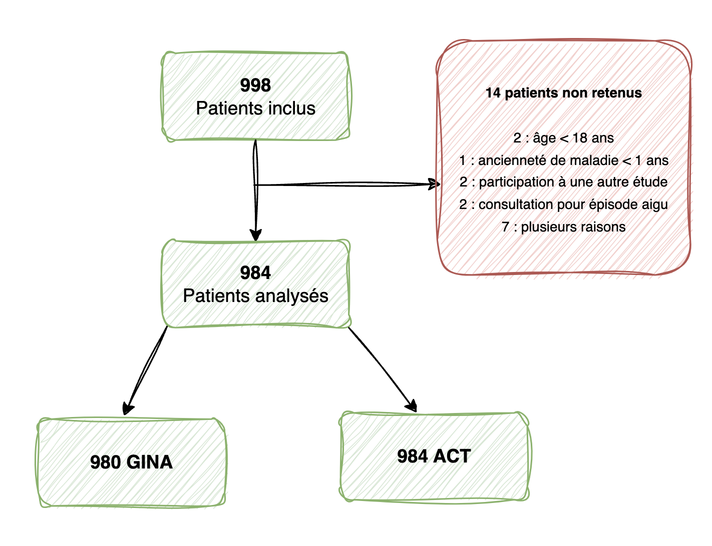

---
output:
  pdf_document:
    toc: false
    toc_depth: 3
    number_sections: true
    fig_caption: true
    fig_height: 6
    fig_width: 8
    citation_package: natbib

bibliography: bibliographie.bib
biblio-style: unsrt

mainfont: "Times New Roman"
fontsize: 11pt
linestretch: 1.5
lang: fr
---

<!-- PAGE DE GARDE  -->

```{=tex}
\begin{titlepage}

\vspace{1cm}
\begin{center}

\textit{Université Paris Cité}

BUT SD 3 FA EMS - Janvier 2025

\vspace{5mm}

\textsc{}

\vfill 

{\Huge\bfseries Rapport TP épidémiologie\par}

{\Large\bfseries Modélisation statistique épidémiologique \par}

\vfill

{\large\itshape Réalisé par}

{\large Rachid SAHLI et Merlin Simsen-Baratault}

\vspace{5mm}

\end{center}
\end{titlepage}
```
```{=tex}
\newpage
\pagenumbering{arabic}
```
\phantomsection

<!-- PAGE DE GARDE: FIN  -->

<!-- TABLE DES MATIÈRES -->

```{=tex}
\newpage
\tableofcontents
```
<!-- TABLE DES MATIÈRES: FIN -->

\newpage

```{=tex}
\vspace*{2cm}
\begin{center}
    \section*{Résumé}
\end{center}
```
\newpage

# Introduction

L’asthme\footnote{Maladie respiratoire chronique due à une inflammation permanente des bronches (crises, gêne respiratoire, essoufflement, toux sèche, ...)} est reconnu comme un problème de santé publique dans tous les pays, quel que soit leur niveau de développement. En effet, on estime la prévalence de l’asthme à 300 millions de personnes dans le monde en 2015\cite{GBD2017}.

Le contrôle de l’asthme est essentiel pour réduire son impact à la fois sur les patients et sur le système de santé. Un mauvais contrôle entraîne une augmentation des consultations médicales, des hospitalisations et des coûts de santé. Les symptômes, principale cause de recours aux soins, nécessitent une évaluation régulière selon les critères du GINA\footnote{Global Initiative fir Asthma} ou via des outils comme l’Asthma Control Test (ACT). Une prise en charge adaptée permet de diminuer la morbidité et la mortalité liées à cette maladie. Pourtant, les études montrent que l’asthme reste insuffisamment contrôlé, avec des taux de non-contrôle atteignant 45 % en Europe et jusqu’à 90 % en Amérique latine et en Asie.

L'objectif de l'étude ESMAA\cite{ESMAA} est d'évaluer le niveau de contrôle de l’asthme chez les patients consultant en routine pour l’asthme au Moyen-Orient et en Afrique du Nord, ainsi que la relation entre le niveau de contrôle et les caractéristiques des patients et de la maladie, l’observance et la qualité de vie.

Dans cette étude, nous analyserons le contrôle de l’asthme en explorant les facteurs associés à travers des analyses statistiques. Nous utiliserons les données de l’étude ESMAA, composées d’un fichier contenant les informations saisies par le médecin et d’un autre avec les données fournies par les patients. Cette approche nous permettra de mettre en lumière les forces et les limites de l’étude, ainsi que d’identifier les facteurs déterminants du contrôle de la maladie. Nous utilisons pour toutes nos analyses le logiciel R.

# Méthodes

## Population d'étude

Notre étude présenté dans ce rapport, est une analyse post-hoc de l'étude ESMAA menée dans 11 pays du Moyen-Orient et d’Afrique du Nord, à savoir l’Algérie, l’Égypte, l’Iran, l’Irak, la Jordanie, le Koweït, le Liban, le Qatar, l’Arabie Saoudite, la Tunisie et les Émirats Arabes Unis. Dans chaque pays, des cliniciens, incluant des généralistes et des spécialistes (tels que pneumologues et allergologues) impliqués dans la prise en charge des patients asthmatiques, ont été sélectionnés de manière aléatoire à partir d’une base de données régionale. La répartition des cliniciens exerçant dans le secteur privé et public était équivalente et indépendante de leur spécialité. Chaque clinicien devait inclure environ 10 patients lors d'une seule consultation. Les patients étaient recrutés en fonction de la disponibilité du clinicien et du temps nécessaire pour remplir les questionnaires. Si l'objectif des 10 patients n'était pas atteint, d'autres consultations étaient organisées en suivant la même méthode. Pour être éligibles, les patients, recrutés lors d'une consultation de routine, devaient avoir 18 ans ou plus, souffrir d'asthme diagnostiqué sur la base de critères cliniques et fonctionnels (spirométrie ou débit expiratoire de pointe en cas de défaut) et présenter une évolution de la maladie d'au moins un an. Les patients fumeurs étaient acceptés, indépendamment de l’intensité du tabagisme. Les critères d'exclusion comprenaient : la présence de troubles psychiatriques ou d'autres pathologies respiratoires (à l'exception de la rhinite), des exacerbations nécessitant une corticothérapie orale, une visite aux urgences ou une hospitalisation dans le mois précédent l'inclusion, la participation à un essai clinique ou la grossesse.

Les informations démographiques et les caractéristiques cliniques des patients ont été collectées par les cliniciens. Quant à la qualité de vie et à la compliance, ces données ont été obtenues via des auto-questionnaires traduits dans les langues locales, remplis par les patients lors de leur consultation. L'évaluation du contrôle de l'asthme a été réalisée par le clinicien selon les critères du GINA, tandis que le patient a utilisé l'échelle ACT. L’activité physique a été mesurée selon les recommandations de l'OMS\footnote{Organisation mondiale de la santé}, prenant en compte des critères tels que les tâches ménagères, la pratique d'un sport ou des loisirs. L’obésité a été définie par un indice de masse corporelle (IMC) supérieur à 30 kg/m². Le protocole de l’étude a été validé par les comités d’éthique des différents pays participants, avec un consentement éclairé obtenu pour chaque patient.

En résumé, l'étude ESMAA est une étude observationnelle non-interventionnelle qui analyse les données de santé d'une population dans plusieurs pays du Moyen-Orient et d'Afrique du Nord. Elle ne manipule pas activement les variables, mais se contente d'observer et d'analyser les facteurs associés au contrôle de l'asthme dans la population. Elle repose sur des méthodes épidémiologiques descriptives, sans intervention spécifique sur les participants. Les données sont collectées sur des variables quantitatives et qualitatives.

Notre analyse s'est concentrée sur l'Algérie, où l'approbation a été obtenue du comité d'éthique du CHU Beni-Messous à Alger. En tout, 998 patients ont été recrutés pour l'étude. Toutefois, 14 d'entre eux ont été exclus en raison du non-respect des critères d'inclusion, ce qui porte la population à 984 patients analysés.

{width="500"}

Dans le cadre de cette étude observationnelle, nous présentons ci-dessous les éléments PECO\footnote{Population, Exposition, Comparaison et Outcome} qui structurent l’analyse des facteurs influençant le contrôle de l’asthme :

|  Éléments   |                                                                       Description                                                                        |
|:-----------:|:---------------------------------------------------------:|
| Population  |                Patients adultes asthmatiques en Algérie, recrutés lors de consultations de routine, incluant les fumeurs et non-fumeurs.                 |
| Exposition  |   Facteurs associés au contrôle de l'asthme : qualité de vie, compliance, activité physique, indice de masse corporelle (IMC), statut tabagique, etc.    |
| Comparaison | Comparaison entre les patients ayant un bon contrôle de l'asthme et ceux ayant un contrôle insuffisant, selon les facteurs étudiés (ex. tabagisme, IMC). |
|   Outcome   |       Niveau de contrôle de l'asthme, évalué par le GINA (clinicien) et l'ACT (patient), ainsi que l'impact des facteurs associés sur ce contrôle.       |
|             |                                                                                                                                                          |

: Description PECO

Dans le cas présent, l'objectif principal de l'étude ESMAA est d'évaluer le niveau de contrôle de l'asthme en Algérie, en se basant sur l'évaluation clinique selon les critères définis par GINA. Les objectifs secondaires comprennent l'identification des facteurs influençant le contrôle de l'asthme, tels que les facteurs environnementaux, la compliance au traitement, les caractéristiques des patients (notamment le tabagisme et les comorbidités), ainsi que les éléments culturels et socio-économiques. L'étude vise également à analyser la relation entre le contrôle de l'asthme et la qualité de vie des patients, tout en explorant les différences de contrôle selon les régions et les pays, afin de mettre en évidence les lacunes dans la gestion de l'asthme dans ces zones géographiques.

Les auteurs ont formulé des hypothèses concernant l'ensemble des pays participants à l'étude. Ils suggèrent que plusieurs facteurs peuvent influencer le contrôle de l'asthme, notamment l'environnement et l'exposition aux allergènes, particulièrement lors des changements saisonniers. Le statut tabagique des patients est également identifié comme un facteur de risque majeur pour un contrôle inadéquat de la maladie. Parmi les autres facteurs, les comorbidités, telles que les troubles du sommeil, peuvent interférer avec la gestion optimale de l'asthme. De plus, la non-adhérence au traitement, les erreurs dans la technique d'inhalation et une thérapeutique inappropriée sont des éléments cruciaux menant à un contrôle sous-optimal. Enfin, les différences culturelles et socio-économiques jouent un rôle déterminant en influençant l'accès aux soins et l'adhésion aux recommandations médicales.

Il est vrai qu'il existe un risque de biais dans cette étude, tant au niveau de la sélection des patients que du classement des données. Le biais de sélection pourrait être lié à la méthode de recrutement des participants, qui se fait sur la base de consultations publiques et privées. Cela pourrait ne pas refléter de manière exhaustive la population des patients asthmatiques en Algérie, et certains groupes pourraient être sous-représentés, ce qui limiterait la généralisation des résultats à l’ensemble de la population. Par ailleurs, le biais de classement pourrait être présent en raison des variations possibles dans l’application des critères de contrôle de l’asthme (basés sur les critères GINA) par les cliniciens. Ces critères peuvent ne pas être appliqués de manière homogène, en raison des différences dans la formation des cliniciens, des pratiques locales ou des interprétations des critères d’évaluation. Cela pourrait affecter l'exactitude de l’évaluation du contrôle de l’asthme et influencer les conclusions tirées de l’étude.

## Définition des variables d'intérêts

Nous disposons de 87 variables fournissant des informations détaillées sur les patients algériens. Elles sont issues du contrôle de l'asthme évalué par les cliniciens selon les critères GINA et par le patient via le questionnaire ACT. Initialement, les variables sont toutes au format caractère. Nous avons recodés uniquement ceux présenteés ci-dessus au format numérique :

Age, Weight (in kg), Height (in cm), BMI (in kg/m²), History of disease, ACT global, SF-8 Physical...24, SF-8 Role...22, SF-8 Bodily, SF-8 General, SF-8 Vitality, SF-8 Social, SF-8 Mental...23, SF-8 Role...17, SF-8 Mental...25, SF-8 Physical...16

Dans notre étude, nous allons nous intéresser aux variables sociodémographiques et aux caractéristiques de la maladie pour décrire le profil des patients asthmatiques et observer d'éventuelles interactions. Ce sont les variables suivantes :

|            Variable             | Description | Type |
|:-------------------------------:|:-----------:|:----:|
|          Âge (années)           |             |      |
|               Sex               |             |      |
|           Weight (kg)           |             |      |
|           Height (cm)           |             |      |
|         BMI ($kg/m^2$)          |             |      |
|            Tabagisme            |             |      |
|   Activité physique régulière   |             |      |
|        Assurance maladie        |             |      |
|      Niveau d'instruction       |             |      |
|    ituation professionnelle     |             |      |
| Ancienneté de l'asthme (années) |             |      |
| Diagnostic de l'asthme \> 5 ans |             |      |
|       Traitements en cour       |             |      |
|      Contrôle de l'asthme       |             |      |
|        Bonne compliance         |             |      |
|              SF-8               |             |      |
|           Act global            |             |      |
|          Hypertension           |             |      |
|            Diabetes             |             |      |
|          Exposure           |             |      |

: Description des variables d'intérêts

## Analyse statistique

\newpage

# Références
